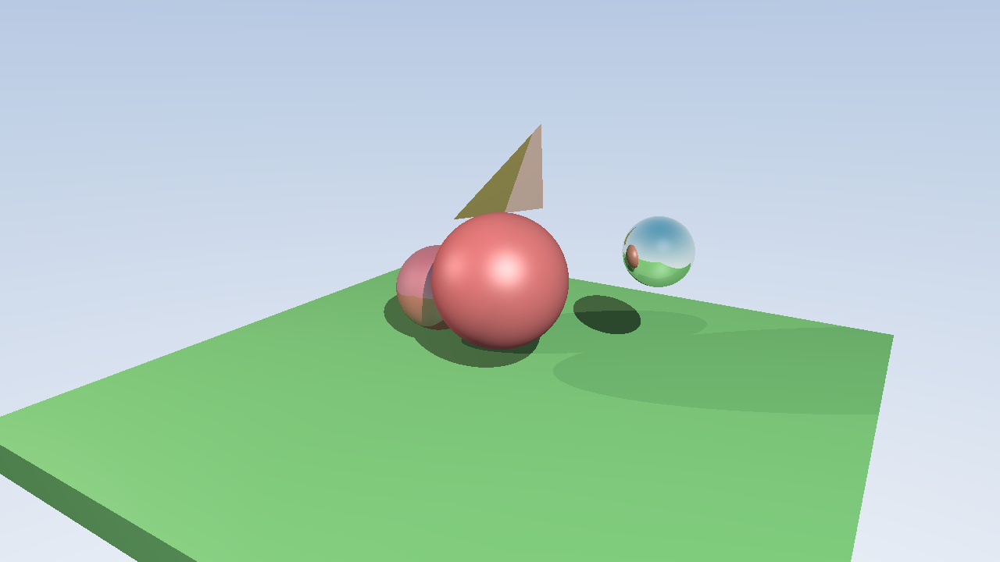

# 🕹️ RayMesh Studio


**RayMesh Studio** is a comprehensive graphics toolkit combining advanced 3D mesh visualization with powerful ray tracing capabilities. It allows users to load, render, and manipulate 3D models with features like mesh slicing, line rasterization, and photo-realistic rendering through ray tracing.

## 👤 Project Information

**Author**: Shreyas Mehta (2023101059)  
**Course**: Computer Graphics (2nd Year, IIIT Hyderabad)  
**Assignment**: 3


*Sunny Day: A bright outdoor-themed scene with warm lighting and a mix of reflective and matte surfaces*


This project was developed as part of the Computer Graphics course at IIIT Hyderabad, exploring advanced 3D graphics techniques including ray tracing, mesh slicing, line rasterization, and polygon filling algorithms.

## 📋 Table of Contents

1. [👤 Project Information](#-project-information)
2. [📖 Introduction](#-introduction)
3. [✨ Features](#-features)
4. [🧊 3D Mesh Viewer](#-3d-mesh-viewer)
5. [⚔️ Mesh Slicing](#️-mesh-slicing)
6. [📝 Line Rasterization](#-line-rasterization)
7. [🎨 Scanline Fill](#-scanline-fill)
8. [🔆 Ray Tracing](#-ray-tracing)
   - [Core Concepts](#core-concepts)
   - [Implementation Details](#implementation-details)
   - [Rendering Pipeline](#rendering-pipeline)
   - [Material System](#material-system)
   - [Light and Shadow](#light-and-shadow)
   - [Reflection](#reflection)
   - [Creating Custom Scenes](#creating-custom-scenes)
   - [Sample Renders](#sample-renders)
9. [🏃‍♂️ Running the Program](#️-running-the-program)
10. [🎮 Controls and UI](#-controls-and-ui)
11. [🧩 Code Structure](#-code-structure)

## 📖 Introduction

This project implements several key computer graphics techniques in a comprehensive toolkit. The main components include:

- A **3D Mesh Viewer** for loading and visualizing OFF model files
- A **Mesh Slicing** module for cutting 3D models with arbitrary planes
- **Line Rasterization** algorithms for drawing 2D lines
- A **Scanline Fill** algorithm for polygon filling
- A powerful **Ray Tracer** for photo-realistic rendering

The core application provides an interactive UI to explore these features, while the ray tracer can also be used as a standalone command-line tool for rendering complex scenes.

## ✨ Features

- **3D Model Visualization**
  - Load and display OFF format models
  - Solid and wireframe rendering modes
  - Normalized model positioning and scaling
  - Real-time rotation and transformation
  
- **Mesh Slicing**
  - Cut 3D models with arbitrary planes
  - CPU-based slicing with polygon reconstruction
  - GPU-based slicing using geometry shaders
  - Interactive plane equation control
  
- **Line Rasterization**
  - Bresenham's line algorithm
  - Digital Differential Analyzer (DDA)
  - Midpoint line algorithm
  - Visual comparison between algorithms
  
- **Polygon Filling**
  - Scanline fill algorithm
  - Interactive polygon creation
  - Efficient edge-tracking implementation
  
- **Ray Tracing**
  - Phong shading with ambient, diffuse, and specular components
  - Multiple primitives: spheres, boxes, triangles
  - Reflection with customizable depth
  - Multiple light sources with shadows
  - OFF model loading and rendering
  - Material system with reflectivity control

## 🧊 3D Mesh Viewer

The 3D Mesh Viewer serves as the main visualization component, allowing you to load and explore 3D models in the OFF format.

### Loading 3D Models

The viewer uses `OFFReader.h` to parse and load 3D models:

```cpp
bool LoadOFFModel(const char* filename)
{
    // Load the model from the OFF file
    model = readOffFile((char*)filename);
    if (!model) {
        std::cerr << "Failed to load model: " << filename << std::endl;
        return false;
    }
    
    // Process vertices, normals, and faces
    // ...
    
    return true;
}
```

After loading, the model is:
- Centered in the viewport
- Scaled to a consistent size
- Given proper normal vectors for lighting calculations

### Lighting and Rendering

The rendering pipeline uses OpenGL shaders with:
- Customizable lighting parameters
- Adjustable object color
- Automatic normal calculation for proper lighting
- Camera position control for different viewing angles

The `onDisplay()` function in `main.cpp` handles the rendering process, including:
- Creating transformation matrices
- Setting up lighting parameters
- Sending data to shaders
- Drawing the model with proper indices

## ⚔️ Mesh Slicing

The mesh slicing feature allows you to cut 3D models with arbitrary planes, revealing their internal structure.

### Implementation Overview: Mesh Slicing

The mesh slicing implementation is contained in `MeshSlicer.h` and provides both CPU-based and GPU-based approaches:

```cpp
class MeshSlicer {
public:
    struct Plane {
        Vector3f normal;  // Normalized plane normal
        float d;          // Distance from origin
        
        // Constructors and utility methods
        // ...
    };
    
    // Core slicing method
    void SliceMesh(
        const std::vector<Vector3f>& inVertices,
        const std::vector<Vector3f>& inNormals,
        const std::vector<unsigned int>& inIndices,
        std::vector<Vector3f>& outVertices,
        std::vector<Vector3f>& outNormals,
        std::vector<unsigned int>& outIndices
    );
    
    // Other methods for plane management
    // ...
};
```

The slicing algorithm works by:
1. Processing each triangle in the mesh
2. Testing against each slicing plane
3. Calculating intersection points when triangles cross planes
4. Reconstructing new polygons from the intersection results
5. Triangulating the resulting polygons for rendering

### CPU vs GPU Slicing

The application offers two slicing modes:

**CPU-based Slicing:**
- Implemented in the `MeshSlicer` class
- Precise polygon reconstruction
- Handles multiple slicing planes in sequence
- Creates new geometry that preserves proper normals

**GPU-based Slicing:**
- Implemented in the `slice.gs` geometry shader
- Real-time performance even for complex models
- Uses the discard pattern to remove geometry outside the slicing planes
- Maintains original vertex attributes

The UI lets you switch between these modes and control up to 4 slicing planes with visual feedback.

## 📝 Line Rasterization

The Line Rasterization module provides implementations of classic algorithms for drawing 2D lines on a raster display.

### Implementation Overview: Line Rasterization

The `LineRasterizer.h` file implements three fundamental line drawing algorithms:

```cpp
class LineRasterizer {
public:
    // Bresenham's line algorithm
    static std::vector<Pixel> BresenhamLine(int x0, int y0, int x1, int y1);
    
    // Digital Differential Analyzer
    static std::vector<Pixel> DDALine(int x0, int y0, int x1, int y1);
    
    // Midpoint line algorithm
    static std::vector<Pixel> MidpointLine(int x0, int y0, int x1, int y1);
};
```

Each algorithm returns a vector of `Pixel` structs representing the discretized points along the line.

### Algorithms Implemented

**Bresenham's Line Algorithm:**
- Integer-based calculations for efficiency
- Minimizes error by choosing optimal pixels
- Handles all line cases with consistent behavior

**DDA Line Algorithm:**
- Uses floating-point calculations for higher accuracy
- Iteratively steps along the line using consistent increments
- Simple implementation but potentially slower than Bresenham

**Midpoint Line Algorithm:**
- Decision-based approach for pixel selection
- Optimized for different slope cases
- Handles vertical and horizontal lines as special cases

The implementation includes proper handling of:
- Vertical and horizontal lines
- Lines with negative slopes
- All octants of the 2D plane

The UI lets you visualize and compare the results of these algorithms with different line endpoints.

## 🎨 Scanline Fill

The Scanline Fill module implements a classic polygon filling algorithm that efficiently converts vector polygons into raster representations.

### Implementation Overview: Scanline Fill

The implementation in `ScanlineFill.h` focuses on the edge-tracking scanline algorithm:

```cpp
class ScanlineFill {
public:
    // Main polygon filling method
    static std::vector<Pixel> FillPolygon(const std::vector<std::pair<int, int>>& vertices);
    
    // Advanced method for handling polygons with holes
    static std::vector<Pixel> FillPolygonWithHoles(
        const std::vector<std::pair<int, int>>& outerPolygon,
        const std::vector<std::vector<std::pair<int, int>>>& holes);
};
```

### Algorithm Explained

The scanline fill algorithm works through these steps:

1. **Edge Table Construction:**
   - Collect all edges of the polygon
   - Store their endpoints, slopes, and y-ranges
   - Sort edges by their minimum y-coordinate

2. **Active Edge List (AEL) Processing:**
   - Maintain a list of edges that intersect the current scanline
   - For each scanline (from top to bottom):
     - Add edges from the edge table that start at this scanline
     - Remove edges that end at this scanline
     - Sort edges by their x-intersection with the scanline
     - Fill pixels between pairs of edges
     - Update x-intersections for the next scanline

3. **Special Case Handling:**
   - Horizontal edges
   - Vertices that connect multiple edges
   - Self-intersecting polygons
   - Numerical stability issues

The algorithm is optimized for performance with:
- Pre-allocation of pixel storage for efficiency
- Special handling for horizontal edges
- Proper edge sorting to ensure correct fill patterns
- Robustness against degenerate cases

The UI allows you to create custom polygons point-by-point and see the fill algorithm in action.

## 🔆 Ray Tracing

The ray tracing module is a complete rendering system capable of producing photorealistic images by simulating light paths. Unlike traditional rasterization techniques, ray tracing simulates the physics of light to create realistic shadows, reflections, and lighting effects.

### Core Concepts

The ray tracer is built around these fundamental components:

- **Rays**: Mathematical representations of light paths defined by an origin point and direction vector
- **Camera**: Generates primary rays through image pixels based on a viewing frustum
- **Hittable Objects**: Geometric primitives that rays can intersect with, providing surface information
- **Materials**: Define how surfaces interact with light through reflection, color, and shininess
- **Lights**: Sources of illumination in the scene with position, color, and intensity properties

### Implementation Details

The `RayTracer.h` file implements the complete ray tracing system with several key classes:

```cpp
// Ray structure representing a ray with origin and direction
struct Ray {
    Vector3f origin;
    Vector3f direction;
};

// Material class defining surface properties
class Material {
    Vector3f color;        // Base color
    float ambientCoef;     // Ambient light coefficient
    float diffuseCoef;     // Diffuse reflection coefficient
    float specularCoef;    // Specular highlight coefficient
    float shininess;       // Specular highlight sharpness
    float reflectivity;    // Reflectivity factor (0-1)
};

// Camera class for generating primary rays
class Camera {
    Vector3f origin;
    Vector3f lowerLeftCorner;
    Vector3f horizontal;
    Vector3f vertical;
};

// Primitive classes for ray-object intersection
class Sphere : public Hittable { ... };
class Box : public Hittable { ... };
class Triangle : public Hittable { ... };

// Main ray tracer class
class RayTracer { ... };
```

### Rendering Pipeline

The ray tracing process follows this detailed pipeline:

1. **Camera Setup**: 
   - Define camera position, look direction, and field of view
   - Calculate the view frustum parameters for ray generation

2. **Primary Ray Generation**: 
   - For each pixel (x,y) in the output image:
     - Calculate normalized device coordinates (u,v) in [0,1] range
     - Generate a ray from camera through the pixel into the scene

3. **Ray-Scene Intersection**: 
   - For each ray, find the closest intersection with any scene object
   - Optimized intersection algorithms for each primitive type:
     - Spheres: Analytical solution to ray-sphere equation
     - Boxes: Fast slab method for axis-aligned boxes
     - Triangles: Möller–Trumbore algorithm for efficient testing

4. **Shading Calculation**: 
   - For each intersection point, evaluate the Phong illumination model:
     - Ambient: Global illumination factor
     - Diffuse: Lambert's cosine law for surface orientation
     - Specular: Blinn-Phong model for highlights
   - Calculate shadow rays to determine light visibility

5. **Recursive Ray Tracing**: 
   - For reflective materials, cast secondary rays in reflection direction
   - Apply recursive color contribution with depth limit and attenuation

6. **Pixel Color Determination**:
   - Combine all lighting components and reflection contributions
   - Apply gamma correction for perceptual accuracy
   - Convert final color to RGB byte values for the output image

7. **Output Generation**:
   - Save the rendered image to a PPM file (binary or ASCII format)
   - Display result or process for further applications

### Material System

The ray tracer implements a physically-inspired material system where each material defines how light interacts with a surface:

```cpp
Material redMaterial(Vector3f(0.9f, 0.2f, 0.2f), 0.1f, 0.7f, 0.4f, 32.0f, 0.1f);
//                    |------ color -----|  |amb|  |dif|  |spc|  |shin|  |refl|
```

The parameters control:

- **Base Color**: The intrinsic color of the object under white light
- **Ambient Coefficient**: How much ambient (indirect) light the surface reflects
- **Diffuse Coefficient**: How much diffuse (scattered) light the surface reflects
- **Specular Coefficient**: How much specular (mirror-like) light creates highlights
- **Shininess**: The tightness of specular highlights (higher = smaller, sharper highlights)
- **Reflectivity**: How mirror-like the surface is (0 = no reflection, 1 = perfect mirror)

This flexible system allows creating a wide range of materials from dull matte surfaces to polished metals and mirrors.

### Light and Shadow

The ray tracer supports multiple light sources with different properties:

```cpp
// Add lights with different colors and intensities
rayTracer.addLight(Vector3f(10, 10, 10), Vector3f(1.0f, 0.9f, 0.8f), 0.8f);  // Warm main light
rayTracer.addLight(Vector3f(-10, 5, -5), Vector3f(0.4f, 0.5f, 0.9f), 0.6f);  // Blue fill light
```

Shadow calculation uses ray casting to determine light visibility:

1. For each light source and intersection point:
   - Cast a "shadow ray" from the intersection point toward the light
   - If the shadow ray hits any object before reaching the light, the point is in shadow
   - Apply only ambient lighting to shadowed areas
   - Apply full Phong illumination to lit areas

This creates realistic shadows that depend on scene geometry and light positions.

### Reflection

Reflections are implemented through recursive ray tracing:

```cpp
Vector3f rayColorWithReflection(const Ray& ray, const HittableList& world, int depth) {
    if (depth <= 0) return Vector3f(0.0f); // Base case for recursion
    
    if (world.hit(ray, 0.001f, INFINITY, rec)) {
        // Calculate direct lighting
        Vector3f directColor = calculateLighting(rec, ray, world);
        
        // Add reflection if material is reflective
        if (rec.material.reflectivity > 0.0f) {
            // Calculate reflection direction
            Vector3f reflected = reflect(ray.direction, rec.normal);
            
            // Cast reflection ray and get color recursively
            Ray reflectionRay(rec.point + rec.normal * 0.001f, reflected);
            Vector3f reflectionColor = rayColorWithReflection(reflectionRay, world, depth - 1);
            
            // Mix direct and reflection colors based on material reflectivity
            return directColor * (1.0f - rec.material.reflectivity) + 
                   reflectionColor * rec.material.reflectivity;
        }
        
        return directColor;
    }
    
    // Background color for rays that hit nothing
    return backgroundColor;
}
```

The reflection system includes:

- **Adaptive Recursion Depth**: Limits to prevent excessive ray bounces
- **Perfect Mirror Reflection**: Calculated using the reflection law (angle of incidence = angle of reflection)
- **Fresnel-like Blending**: Mixing direct and reflected colors based on material reflectivity
- **Self-intersection Prevention**: Small offsets to avoid numerical precision issues

### Creating Custom Scenes

The ray tracer supports creating custom scenes through text files with a straightforward format. Here's an example scene file structure:

```
# Camera setup (position, target, up vector, field of view)
camera 5.0 3.0 8.0  0.0 0.0 -1.0  0.0 1.0 0.0  45.0

# Light sources (position, color, intensity)
light 10.0 10.0 10.0  1.0 1.0 1.0  1.0
light -5.0 8.0 3.0  0.6 0.6 1.0  0.7

# Background color
background 0.3 0.5 0.8

# Enable reflections with max depth
reflections 1 4

# Materials and objects
# Format: <object_type> <parameters> <r g b> <ambient> <diffuse> <specular> <shininess> <reflectivity>

# Sphere: center_x center_y center_z radius
sphere 0.0 0.0 0.0 1.0  0.9 0.2 0.2  0.1 0.7 0.3 32.0 0.1

# Box: min_x min_y min_z max_x max_y max_z
box -10.0 -2.0 -10.0  10.0 -1.9 10.0  0.2 0.8 0.2  0.1 0.7 0.2 16.0 0.0

# Triangle: v1_x v1_y v1_z  v2_x v2_y v2_z  v3_x v3_y v3_z
triangle 3.0 -2.0 -3.0  4.5 -2.0 -4.0  3.5 1.0 -3.5  0.8 0.8 1.0  0.1 0.2 0.8 64.0 0.6

# OFF model: filename (looks for file in models/ directory)
off_model 4hhb.off  0.7 0.5 0.3  0.2 0.6 0.4 32.0 0.0
```

**Key Assumptions and Requirements:**

1. **Scene Scale**:
   - The scene operates in an arbitrary unit scale
   - Typically, a unit of 1.0 represents approximately 1 meter
   - Objects should be placed within a reasonable distance from the origin
   - Camera positions typically range from 5-20 units away from the scene center

2. **Coordinate System**:
   - Right-handed coordinate system with Y-axis up
   - Positive Z axis points away from the default camera position
   - Camera looks toward negative Z by default

3. **Materials**:
   - Material parameters must be in the range [0.0, 1.0] for most properties
   - Shininess can range from 1.0 (broad highlights) to 128.0+ (sharp highlights)
   - Reflectivity should be kept below 1.0 to avoid fully reflective surfaces
   - Best practice is to keep the sum of ambient + diffuse + specular coefficients around 1.0

4. **Lighting**:
   - At least one light source is required for proper rendering
   - Light intensity typically ranges from 0.5 to 1.0
   - Light positions should be outside of most objects to avoid internal lighting issues

5. **OFF Models**:
   - OFF files must be located in the "models/" directory
   - Large models may significantly increase rendering time
   - The first parameter after the filename acts as both a material color and a scale factor
   - The scale is auto-calculated based on model bounding box

### Sample Renders

The project includes several sample scenes demonstrating different ray tracing capabilities:


*Abstract Art: An artistic composition featuring spheres with varied materials and reflections against a gradient blue sky*


*Cornell Box: A classic ray tracing test scene with colored walls and spheres demonstrating light reflection and shadow casting*


*Glass Prism: A tetrahedron with glass-like material properties demonstrating specular highlights and partial transparency*


*Reflective Spheres: Multiple spheres with varying reflectivity properties showing inter-reflection effects and material diversity*


*Sample Model: A 3D mesh loaded from an OFF file rendered with custom lighting and material settings*


*Sample Scene: A composite scene with various primitive shapes showcasing the ray tracer's handling of different materials*

The sample scenes can be rendered using the ray tracer demo:

```bash
# Render the Cornell box scene at 1280x720 resolution
./ray_tracer_demo --scene file --file scenes/cornell_box.txt --output my_render.ppm --resolution 1280 720

# Render all available sample scenes (using the provided script)
./render_all_scenes.sh
```

## 🏃‍♂️ Running the Program

### 🔧 Prerequisites

The following libraries are required:
- **OpenGL** (version 3.3 or higher)
- **GLFW** – Window and input handling
- **GLEW** – OpenGL extension wrangler
- **GLM** – Math library for vectors/matrices
- **ImGui** – Graphical user interface

### 📦 Compilation

1. Build the main application:
   ```bash
   make
   ```

2. Build the ray tracer demo:
   ```bash
   make ray_tracer_demo
   ```

### ▶️ Main Application

Run the interactive application:
```bash
./sample
```

This launches the GUI with all features:
- 3D model viewer
- Mesh slicing
- Line rasterization
- Scanline fill

### 📷 Ray Tracer Demo

Run the standalone ray tracer:
```bash
./ray_tracer_demo [options]
```

Options:
- `--output FILE`: Specify output file name (default: render.ppm)
- `--scene TYPE`: Choose scene type: simple, mesh, file (default: simple)
- `--model NAME`: Specify model for mesh scenes (default: 1grm)
- `--file FILENAME`: Provide a scene description file
- `--resolution W H`: Set image resolution (default: 800x600)

Example:
```bash
./ray_tracer_demo --scene mesh --model 4hhb --output protein_model.ppm --resolution 1280 720
```

## 🎮 Controls and UI

The main application provides these UI panels:

**3D Model Viewer:**
- Load OFF models
- Switch between solid and wireframe rendering
- Adjust object color
- Control model rotation

**Mesh Slicing:**
- Toggle between CPU and GPU slicing
- Control up to 4 slicing planes
- Adjust plane equations (normal and distance)
- Apply slicing and reset models

**Line Rasterization:**
- Set line endpoints
- Choose between Bresenham, DDA, or Midpoint algorithms
- Visualize rasterized pixels

**Scanline Fill:**
- Define polygon vertices
- Fill polygons and visualize results

## 🧩 Code Structure

### Core Files

- **main.cpp** – Main application with OpenGL setup and UI integration
- **ray_tracer_demo.cpp** – Standalone ray tracing application
- **Makefile** – Build configuration

### Helper Classes

- **LineRasterizer.h** – Line drawing algorithms
- **ScanlineFill.h** – Polygon filling algorithm
- **MeshSlicer.h** – 3D model slicing implementation
- **RayTracer.h** – Complete ray tracing system
- **math_utils.h** – Vector and matrix operations
- **OFFReader.h** – Model loading from OFF files

### Shaders

- **shader.vs** – Vertex shader for 3D model rendering
- **shader.fs** – Fragment shader for 3D model rendering
- **slice.gs** – Geometry shader for GPU-based model slicing

